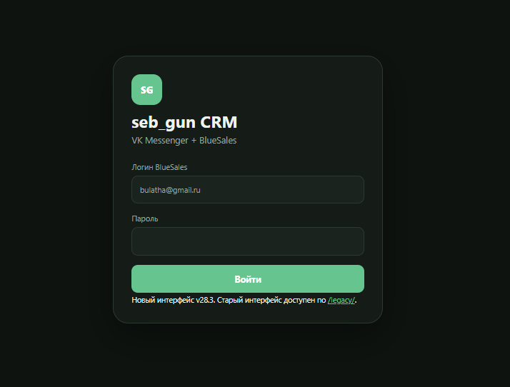
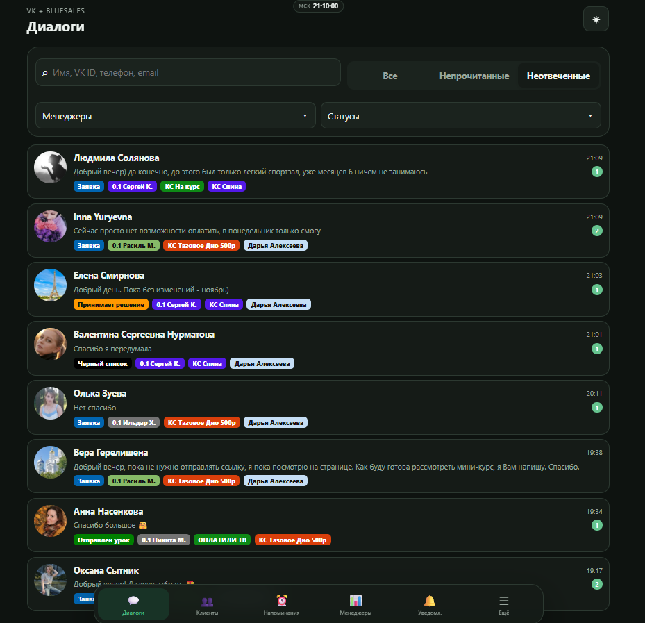
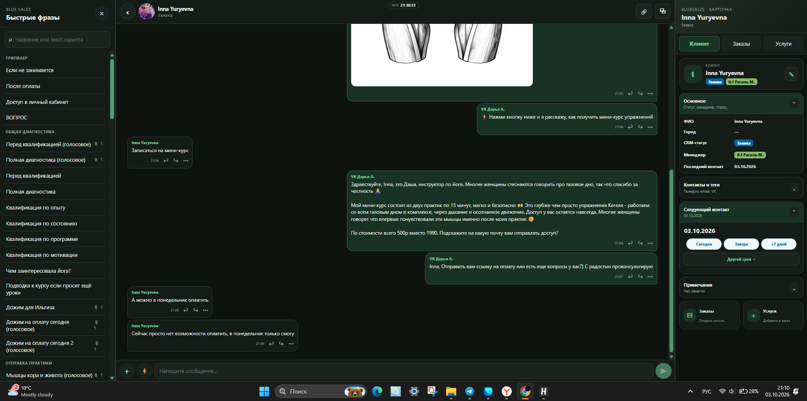
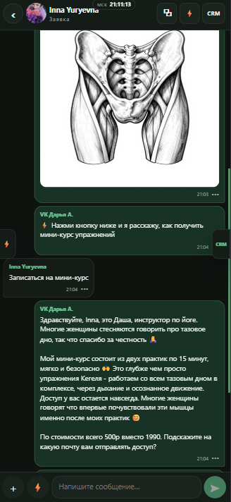
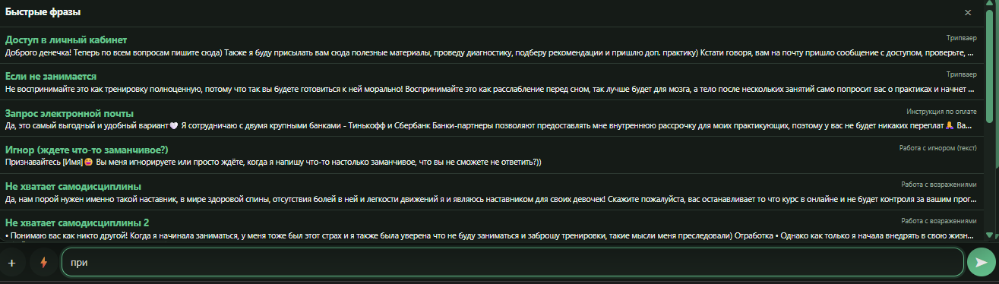
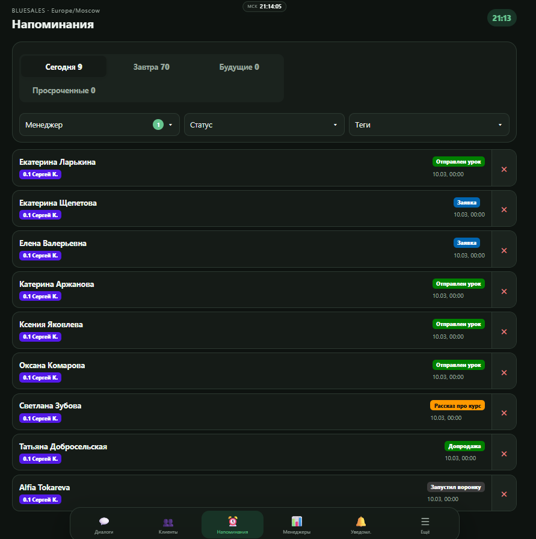
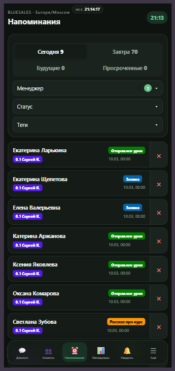
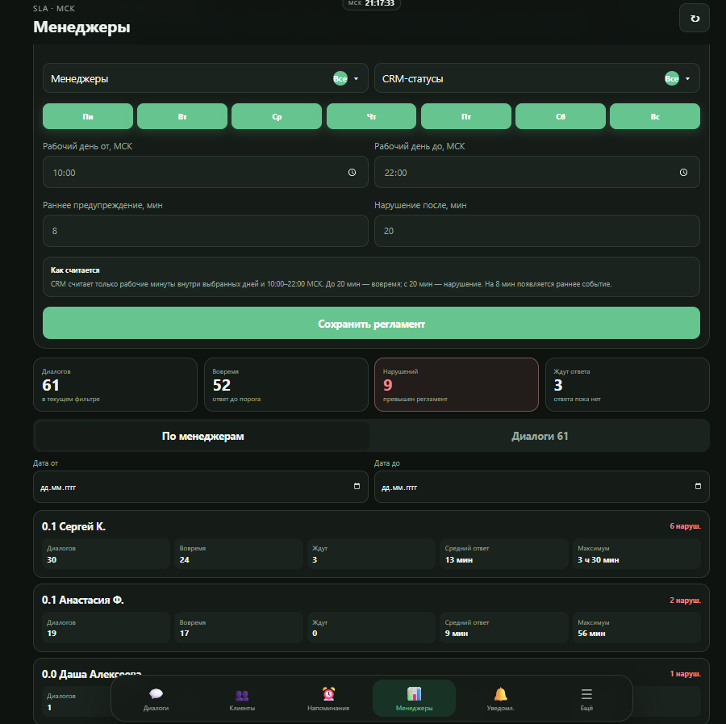
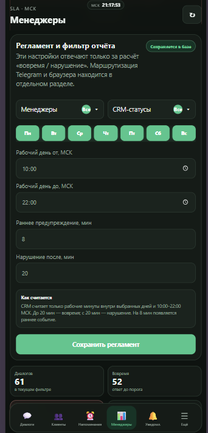
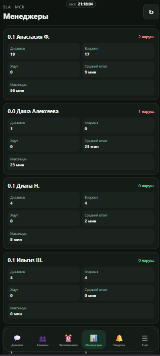

# seb_gun CRM

CRM-система для работы с обращениями клиентов из VK с интеграцией BlueSales, контролем SLA, напоминаниями и инструментами для менеджеров.

Проект создавался как рабочий интерфейс для объединения переписки, карточки клиента, быстрых фраз, напоминаний и контроля качества обработки лидов в одном окне.

## Возможности

- единый список диалогов с фильтрами по менеджеру, статусу и типу обращения;
- просмотр переписки с клиентом и быстрый переход к карточке клиента;
- быстрые фразы и сценарии ответов для менеджеров;
- напоминания по клиентам с фильтрами и сроками следующего контакта;
- контроль SLA и времени ответа менеджеров;
- отчёт по нарушениям регламента и статистика по менеджерам;
- распределение и контроль лидов;
- адаптивный интерфейс для desktop и mobile;
- интеграция с VK и BlueSales;
- работа с PostgreSQL и развёртывание веб-приложения на Render.

## Интерфейс системы

Ниже представлены основные экраны desktop- и mobile-версий CRM. Скриншоты добавлены в исходном формате **PNG**, без перевода в JPEG, чтобы сохранить исходную чёткость интерфейса.

На рисунке 1 показан экран входа в **seb_gun CRM**. Пользователь авторизуется с учётными данными BlueSales и после входа получает доступ к единому интерфейсу CRM.

*Рисунок 1 — экран авторизации seb_gun CRM.*

На рисунке 2 можно ознакомиться с основным списком клиентских диалогов. Доступны поиск, фильтрация по менеджерам и CRM-статусам, а также отдельные режимы просмотра всех, непрочитанных и неотвеченных обращений. В карточках диалогов отображаются последнее сообщение, время, ответственный менеджер, статус и дополнительные теги.

*Рисунок 2 — список диалогов с фильтрами, статусами и тегами.*

На рисунке 3 показано основное рабочее место менеджера в desktop-версии. Слева расположен справочник быстрых фраз, в центре — переписка с клиентом, а справа — карточка BlueSales с CRM-статусом, менеджером, контактами, тегами и датой следующего контакта. Такой экран позволяет работать с обращением без постоянного переключения между несколькими сервисами.

*Рисунок 3 — единое рабочее окно: быстрые фразы, переписка и карточка клиента.*

На рисунке 4 представлена адаптивная мобильная версия переписки. В ней сохранены основные возможности desktop-интерфейса: просмотр сообщений и вложений, быстрый переход к CRM, отправка сообщений и работа с диалогом со смартфона.

  

*Рисунок 4 — адаптивная мобильная версия клиентского диалога.*

На рисунке 5 можно увидеть раздел **«Быстрые фразы»**. Менеджер может искать готовые сценарии по названию или содержимому, выбирать подходящую фразу и быстро подставлять её в сообщение. Шаблоны сгруппированы по назначению: диагностика, квалификация, работа с возражениями, оплата и другие сценарии.

*Рисунок 5 — поиск и использование готовых сценариев ответов.*

На рисунке 6 показан раздел напоминаний. Задачи разделяются на **«Сегодня»**, **«Завтра»**, **«Будущие»** и **«Просроченные»**. Дополнительно доступны фильтры по менеджеру, статусу и тегам. Для каждого клиента отображаются ответственный менеджер, CRM-статус и срок следующего контакта.

*Рисунок 6 — управление следующими контактами и напоминаниями в desktop-версии.*

На рисунке 7 представлен тот же раздел напоминаний в адаптивном мобильном интерфейсе. Основные фильтры и карточки задач остаются доступны на небольшом экране, что позволяет менеджеру контролировать следующие контакты без компьютера.

  

*Рисунок 7 — мобильная версия раздела напоминаний.*

На рисунке 8 показан раздел контроля SLA. Здесь настраиваются рабочие дни и рабочее время, порог раннего предупреждения и время, после которого отсутствие ответа считается нарушением регламента. Ниже выводится сводная статистика: количество диалогов, ответы вовремя, нарушения и лиды, ожидающие ответа, а также показатели по каждому менеджеру.

*Рисунок 8 — настройка регламента SLA и аналитика работы менеджеров.*

На рисунке 9 можно ознакомиться с адаптивной формой настройки SLA. На мобильном устройстве доступны выбор менеджеров и CRM-статусов, рабочие дни, время начала и окончания рабочего дня, раннее предупреждение и порог нарушения.

  

*Рисунок 9 — параметры регламента SLA в мобильной версии.*

На рисунке 10 показана мобильная часть отчёта по менеджерам. Для каждого сотрудника отображаются количество диалогов, число ответов вовремя, количество ожидающих ответа обращений, среднее и максимальное время ответа, а также количество нарушений SLA.

  

*Рисунок 10 — статистика SLA по менеджерам в мобильном интерфейсе.*

## SLA

В системе предусмотрен контроль рабочего времени и скорости ответа менеджеров.

Пример регламента:
- рабочее время: 10:00–22:00 МСК;
- раннее предупреждение: через 8 минут без ответа;
- нарушение SLA: через 20 минут без ответа.

Параметры можно настраивать в интерфейсе.

## Основные экраны

### Диалоги
Менеджер видит список обращений, последние сообщения, статусы, ответственного менеджера и количество непрочитанных сообщений.

### Карточка клиента
В одном окне отображаются:
- переписка;
- CRM-статус;
- менеджер;
- контакты и теги;
- дата следующего контакта;
- заказы и услуги.

### Быстрые фразы
Поиск по готовым сценариям и шаблонам сообщений помогает быстрее отвечать клиентам и соблюдать единый стиль коммуникации.

### Напоминания
Отдельный раздел для контроля следующих контактов: сегодня, завтра, будущие и просроченные задачи.

### SLA и менеджеры
Экран показывает:
- количество диалогов;
- ответы в пределах регламента;
- нарушения;
- лиды без ответа;
- среднее и максимальное время ответа по каждому менеджеру.

## Моя роль в проекте

В рамках проекта я занимался:
- постановкой и уточнением требований к CRM;
- описанием пользовательских сценариев и бизнес-логики;
- проектированием логики SLA, уведомлений и распределения лидов;
- проверкой интерфейсов и API;
- поиском и описанием ошибок, включая HTTP 4xx/5xx;
- тестированием desktop/mobile интерфейсов;
- работой с интеграциями и данными;
- использованием AI-инструментов для прототипирования, анализа кода и подготовки технических решений.

Проект использую как пример практической работы в направлении системного анализа, QA и автоматизации бизнес-процессов.

## Технологии и инструменты

- VK API
- BlueSales
- PostgreSQL
- REST API
- Render
- Git / GitHub
- HTML / CSS / JavaScript
- AI-assisted development

## Статус

Проект развивается: добавляются инструменты контроля SLA, уведомления, журнал лидов, улучшения мобильного интерфейса и администрирования.

---

**Автор:** Сергей Каличенок  
**GitHub:** @sebastiangun
